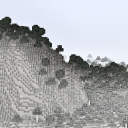

# Noisium

Optimises worldgen performance for a better gameplay experience.

The improvements lie between a 20-30% speedup when generating new chunks in vanilla Minecraft (benchmarked on 1.20.1 Fabric).

## Dependencies

### Required

None.

## Incompatibilities

No known incompatibilities at this time.

## Download

See the version info in the filename for the supported Minecraft versions.  
Made for the Fabric and Quilt modloaders.  
Server side.

## FAQ

- Q: Will you be backporting this mod to lower Minecraft versions?  
  A: No.

- Q: Will you port this mod to Forge?  
  A: Also no.

- Q: Does this mod work in multiplayer?  
  A: Yes, but it'll only improve performance on the server.

- Q: Does only the server need this mod or does the client need it too?  
  A: Only the server needs this mod (but it works on the client too if you're going to host LAN or play singleplayer).

## Attribution

Thanks to [Builderb0y](https://modrinth.com/user/Builderb0y) for giving great starting points and helping with some issues.

## License

This project is licensed under LGPLv2.1, see [LICENSE](https://github.com/Steveplays28/noisium/blob/main/LICENSE).
